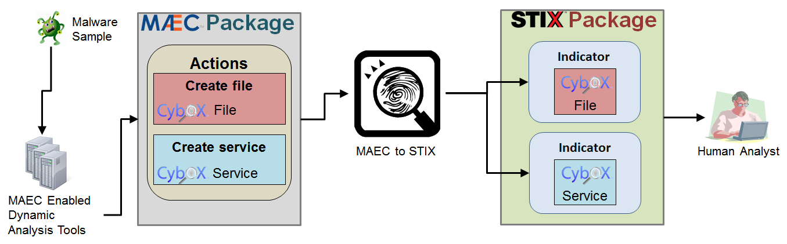

Indicator Extraction 
============================
This page describes the premise behind the indicator extraction process used in
**maec-to-stix**, for extracting STIX Indicators from MAEC Packages.

Overview
~~~~~~~~

The diagram below highlights the overall process of extracting Indicators from
MAEC Packages, starting with the generation of the MAEC output from some dynamic
analysis tool (such as `Cuckoo Sandbox`_) and ending with inspection of the
resulting STIX Indicators by a human analyst. More details on the actual process
of extracting Indicators from MAEC is provided in the sections below. 

.. _Cuckoo Sandbox: http://www.cuckoosandbox.org/

MAEC Actions
~~~~~~~~~~~~
One of the fundamental MAEC entities captured in the MAEC Package is the MAEC Action.
MAEC Actions represent discrete abstractions of system-level API calls,
and thus are the types of activity recorded by dynamic analysis tools (sandboxes)
such as Cuckoo, ThreatExpert, Anubis, etc. 

Actions provide context as to the changes the malware made on the system, by
specifying the particular **type** of action that was performed, such as
*create file*, along with the entities that they operated on. In MAEC Actions,
such entities are represented with CybOX Objects, such as the File Object,
Windows Registry Key Object, etc. 

Actions → Indicators
~~~~~~~~~~~~~~~~~~~~~~
Certain types of Actions can leave detectable artifacts, whether they are discoverable
on an endpoint (such as files on the system where the malware executed) or on some 
enterprise-level appliance (such as connection requests to particular IP addresses 
on a network gateway). Accordingly, it follows that such Actions make a good basis for
the creation of indicators, as having the knowledge of those types of Actions that
leave detectable artifacts means that their resulting artifacts can be used as the basis 
for detection, i.e. as indicators. 

Thus, the high-level indicator extraction process flow in maec-to-stix is:

1. **Parse Input MAEC Document**
2. **Extract MAEC Actions**
3. **Look for Actions with Detectable Artifacts**
4. **Perform Artifact Sanity/Consistency checking**
5. **Create STIX Indicators for acceptable Artifacts (from 4.)**
6. **Output STIX Indicators in new STIX Package**

For more information on this process, particularly with regards to step 4,
please refer to :doc:`process`.

It is important to note that this process is not fool-proof. Automatically
constructing indicators from such Actions is at best a *starting point* for 
malware-oriented detection. However, it is **HIGHLY** recommended that such
indicators still be vetted by a human analyst in order to ensure that they do 
not lead to false negatives or false positives.

Example
~~~~~~~
The following basic example demonstrates this premise with a notional MAEC Action
and the STIX Indicator that results from it after automatic extraction.

**Input MAEC Action**

.. code-block:: xml

    <maecBundle:Action>
      <cybox:Name xsi:type="maecVocabs:FileActionNameVocab-1.0">create file</cybox:Name>
      <cybox:Associated_Objects>
        <cybox:Associated_Object>
          <cybox:Properties xsi:type="FileObj:FileObjectType">
            <FileObj:File_Path>C:\T3MP\lbsec.dll</FileObj:File_Path>
            <FileObj:Size_In_Bytes>619</FileObj:Size_In_Bytes>
          </cybox:Properties>
          <cybox:Association_Type>output</cybox:Association_Type>
        </cybox:Associated_Object>
      </cybox:Associated_Objects>
    </maecBundle:Action>

**Output STIX Indicator**

.. code-block:: xml

    <stix:Indicator xsi:type='indicator:IndicatorType'>
        <indicator:Title>Malware Artifact Extracted from MAEC Document</indicator:Title>
        <indicator:Observable>
          <cybox:Object>
            <cybox:Properties xsi:type="FileObj:FileObjectType">
              <FileObj:File_Path condition="Equals">C:\T3MP\lbsec.dll</FileObj:File_Path>
              <FileObj:Size_In_Bytes conditions="Equals">619</FileObj:Size_In_Bytes>
            </cybox:Properties>
          </cybox:Object>
        </indicator:Observable>
    </stix:Indicator>
	
Again, this is a very simplistic example, but it demonstrates that the context
provided by the MAEC Action - that the file was created as the output of the 
action - allows us to make the determination that it could be suitable as a STIX 
Indicator.  
